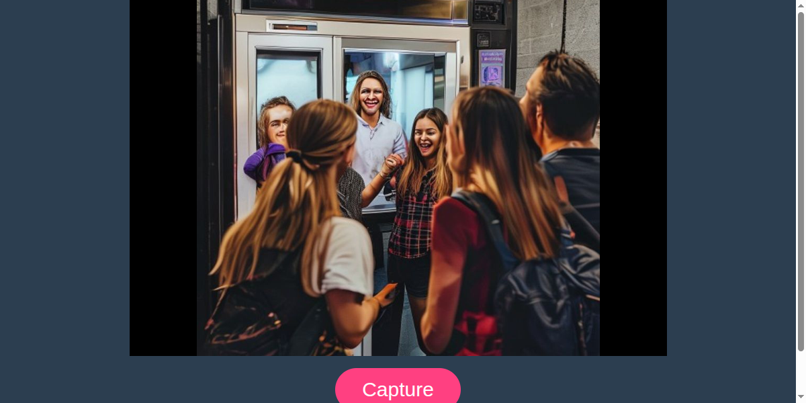

# Lumix Photobooth

A minimal Electron application for running a photobooth using a Lumix camera.



## Prerequisites

Get Node.js if you haven't already. [We highly recommend using nvm](https://github.com/creationix/nvm).
- Node.js >= 20.0.0 is required.

## Setup

```bash
npm install
```

*Note: This project strictly uses npm for package management.*

## Running the Application

1. Start camera
2. Click MENU
3. Select WiFi under settings
4. Wi-Fi Function
5. New Connection
6. Remote Shooting ^ View
7. Run the application:

```bash
npm start
```

## Configuration

Configuration settings can be found and modified in `app/js/config.js`:

- `PORT`: The UDP port for the camera livestream (default: `49473`).
- `preferredImageSize`: Sets the image quality to download. Options include:
  - `CAM_ORG` (Original)
  - `CAM_LRGTN` (Large)
  - `CAM_TN` (Thumbnail)
- `AUTO_PRINT`: Enables or disables automatic silent printing (default: `true`).

## Compatibility

- **Node.js**: Requires version 20.0.0 or higher.
- **Camera**: Configured and tested with the Lumix DMC-G7 camera.
- **Platform**: Runs on standard Electron platforms (includes specific optimizations for Linux/Wayland compatibility).
